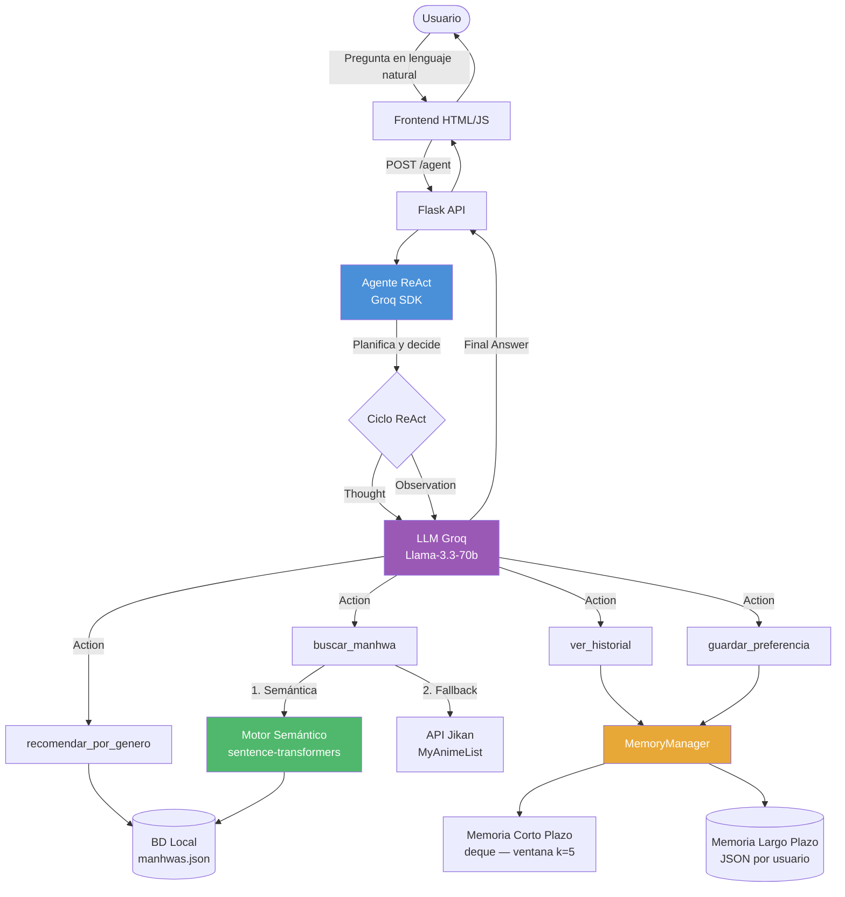

# ManhwaBot — Agente RAG con Memoria, Planificación y Observabilidad

> Asistente conversacional inteligente para consultas sobre manhwa, manga y manhua.  
> Arquitectura de agente **ReAct** (Reasoning + Acting) con memoria de corto y largo plazo,  
> instrumentado con métricas de observabilidad y dashboard de monitoreo.

**Curso:** ISY0101 — Ingeniería de Soluciones con IA  
**Autores:** Cristopher Alexander Ramírez Ubilla  
**Versión:** 3.0 — Observabilidad y Seguridad (EP3)

---

## Tabla de Contenidos

1. [Descripción General](#descripción-general)
2. [Arquitectura del Sistema](#arquitectura-del-sistema)
3. [Componentes Implementados](#componentes-implementados)
4. [EP3 — Observabilidad y Seguridad](#ep3--observabilidad-y-seguridad)
5. [Decisiones de Diseño](#decisiones-de-diseño)
6. [Instalación paso a paso](#instalación-paso-a-paso)
7. [Cómo usar la aplicación](#cómo-usar-la-aplicación)
8. [Dashboard de Observabilidad](#dashboard-de-observabilidad)
9. [Límites del sistema](#límites-del-sistema)
10. [API Endpoints](#api-endpoints)
11. [Flujos de Trabajo](#flujos-de-trabajo)
12. [Estructura del Repositorio](#estructura-del-repositorio)
13. [Referencias Bibliográficas](#referencias-bibliográficas)

---

## Descripción General

ManhwaBot es un **agente funcional** que integra herramientas de consulta, escritura y razonamiento para responder preguntas sobre contenido de lectura digital. El sistema utiliza el patrón **ReAct** (Yao et al., 2022) para combinar razonamiento en lenguaje natural con la invocación autónoma de herramientas, sin depender de frameworks externos de agentes.

### Capacidades del agente

| Capacidad | Descripción |
|---|---|
| Consulta semántica | Recupera información con embeddings multilingües |
| Búsqueda externa | Consulta la API Jikan (MyAnimeList) |
| Recomendaciones | Filtra títulos por género o tema |
| Memoria de sesión | Mantiene contexto de las últimas 5 interacciones |
| Memoria persistente | Guarda historial y preferencias del usuario en disco |
| Planificación | Decide autónomamente qué herramienta usar en cada paso |
| Control de dominio | Rechaza preguntas fuera del ámbito manhwa/manga/manhua |

---

## Arquitectura del Sistema

### Diagrama general de orquestación



### Diagrama de capas

```
┌─────────────────────────────────────────────────────────────┐
│                     CAPA DE PRESENTACIÓN                     │
│              frontend/index.html  (HTML + JS)                │
└─────────────────────────┬───────────────────────────────────┘
                          │ HTTP POST /agent
┌─────────────────────────▼───────────────────────────────────┐
│                      CAPA DE API                             │
│                  backend/app.py  (Flask)                     │
│        Endpoints:  /chat (legacy)  /agent  /health          │
└─────────────────────────┬───────────────────────────────────┘
                          │
┌─────────────────────────▼───────────────────────────────────┐
│                    CAPA DE AGENTE                            │
│               backend/agent.py  (Groq SDK — ReAct)          │
│   LLM: Groq Llama-3.3-70b  │  Prompt ReAct en español      │
│   Ciclo: Thought → Action → Observation → Final Answer      │
└──────────┬──────────────────────────────────┬───────────────┘
           │                                  │
┌──────────▼──────────┐             ┌─────────▼──────────────┐
│    CAPA DE TOOLS    │             │    CAPA DE MEMORIA      │
│   backend/tools.py  │             │ backend/memory_manager  │
│                     │             │                         │
│ • buscar_manhwa     │             │ Corto plazo:            │
│ • recomendar_por_   │             │  deque(maxlen=5)        │
│   genero            │             │  en RAM por sesión      │
│ • ver_historial     │             │                         │
│ • guardar_prefe-    │             │ Largo plazo:            │
│   rencia            │             │  JSON por usuario       │
└──────────┬──────────┘             │  data/sessions/         │
           │                        └─────────────────────────┘
┌──────────▼──────────┐
│ CAPA DE RECUPERACIÓN│
│ semantic_search.py  │
│ rag_pipeline.py     │
│ API Jikan           │
│ BD Local JSON       │
└─────────────────────┘
```

---

## Componentes Implementados

### 1. Agente ReAct — `backend/agent.py`

Implementa el patrón **ReAct** (Reasoning + Acting) mediante parsing de texto. En cada turno el LLM genera un bloque estructurado que el sistema parsea para ejecutar herramientas:

```
Thought: El usuario pregunta por un manhwa de terror. Uso recomendar_por_genero.
Action: recomendar_por_genero
Action Input: Terror
                        ← sistema inyecta la observación aquí
Observation: • Sweet Home (Score: 8.4) — Hyun Cha queda atrapado...
Thought: Tengo suficiente información.
Final Answer: Te recomiendo Sweet Home...
```

### 2. Herramientas del Agente — `backend/tools.py`

| Herramienta | Función | Fuente de datos |
|---|---|---|
| `buscar_manhwa` | Información detallada de un título | BD local + Jikan API |
| `recomendar_por_genero` | Lista de títulos por género | BD local |
| `ver_historial` | Historial de lectura del usuario | Memoria LP (JSON) |
| `guardar_preferencia` | Registra una calificación | Memoria LP (JSON) |

### 3. Memoria — `backend/memory_manager.py`

**Corto plazo** (`deque` con `maxlen=5`):
- Ventana deslizante de las últimas 5 interacciones almacenada en RAM.
- Se incluye automáticamente en cada invocación del agente como historial.
- Al superar 5 turnos descarta el más antiguo automáticamente.

**Largo plazo** (JSON persistente en `backend/data/sessions/{user_id}.json`):
- Guarda preferencias con calificación y fecha.
- Guarda historial de títulos consultados.
- Persiste entre sesiones; no se pierde al reiniciar el servidor.

### 4. Búsqueda Semántica — `backend/semantic_search.py`

Recuperación de contexto semántico (IE4) usando embeddings:

- **Modelo**: `paraphrase-multilingual-MiniLM-L12-v2` (soporta español).
- **Proceso**: genera embeddings del corpus al inicio; calcula similitud coseno contra la query.
- **Threshold**: descarta resultados con similitud < 0.25 para evitar falsos positivos.
- **Ventaja**: encuentra títulos aunque la pregunta no use las palabras exactas del título.

### 5. Pipeline RAG Legado — `backend/rag_pipeline.py`

Mantiene el endpoint `/chat` original. Usa MarianMT para traducción EN→ES con carga diferida (no bloquea el inicio del servidor).

---

---

## EP3 — Observabilidad y Seguridad

### Inicio rápido EP3

```bash
# 1. Instalar dependencias (incluye streamlit, pandas, plotly, matplotlib)
pip install -r requirements.txt

# 2. Generar datos de demostración (no requiere API key)
python tests/seed_metrics.py

# 3. Lanzar el dashboard de observabilidad
python -m streamlit run dashboard/streamlit_app.py

# 4. Generar informe HTML + gráficos PNG para el informe Word
python tests/generate_report.py

# 5. (Opcional) Iniciar el backend para generar métricas reales
cd backend && python app.py
```

### Métricas implementadas

| Categoría | Métrica | Archivo | IE |
|---|---|---|---|
| Precisión / Éxito | Tasa de requests con `Final Answer` vs timeout/error | `requests.jsonl` | IE1 |
| Consistencia | Similitud Jaccard entre respuestas a la misma query | `requests.jsonl` | IE1 |
| Frecuencia de errores | % de requests con excepción o sin `Final Answer` | `requests.jsonl` | IE1 |
| Latencia total | Tiempo extremo a extremo por request (ms) | `requests.jsonl` | IE2 |
| Latencia por herramienta | Tiempo de ejecución de cada tool call (ms) | `tools.jsonl` | IE2 |
| Tokens consumidos | prompt_tokens + completion_tokens acumulados | `requests.jsonl` | IE2 |
| Iteraciones ReAct | Número de ciclos Thought→Action por request | `requests.jsonl` | IE3 |
| Frecuencia de herramientas | Distribución de llamadas por nombre de herramienta | `tools.jsonl` | IE3 |

### Seguridad y uso responsable (IE6)

| Protocolo | Implementación | Archivo |
|---|---|---|
| Validación de entrada | Límite 500 chars + blocklist de jailbreak (regex) | `backend/security.py` |
| Sanitización | Eliminación de caracteres de control (OWASP LLM01) | `backend/security.py` |
| Rate limiting | Ventana deslizante 20 req/min por user_id | `backend/security.py` |
| Path traversal | Sanitización de user_id (solo `[a-zA-Z0-9_-]`) | `backend/security.py` |
| Privacidad | user_id hasheado con SHA-256 en logs; pregunta no persiste | `backend/observability.py` |
| No exposición de errores | Stack traces solo en logs del servidor, nunca al cliente | `backend/app.py` |
| Restricción de dominio | System Prompt rechaza preguntas fuera de manhwa/manga | `backend/agent.py` |

### Detección de anomalías (IE4)

El dashboard detecta automáticamente tres tipos de anomalías en los registros:

1. **Latencia alta** — requests con latencia > μ + 2σ (outliers estadísticos)
2. **Timeout de planificación** — requests que alcanzan las 6 iteraciones máximas sin `Final Answer`
3. **Excepción en ejecución** — requests con error de la API Groq u otra excepción

---

## Decisiones de Diseño

### ¿Por qué Groq SDK directo en vez de LangChain Agents?

Durante el desarrollo se probaron `create_react_agent` y `create_tool_calling_agent` de LangChain, pero presentaron incompatibilidades con Python 3.14 y con `llama-3.3-70b-versatile` (el modelo generaba function calls en formato propietario `<function=...>` en vez del estándar JSON). La solución fue implementar el loop ReAct directamente sobre el SDK de Groq, ganando control total del ciclo y eliminando dependencias frágiles.

### ¿Por qué Groq + Llama-3.3-70b?

Groq ofrece una API gratuita con latencia extremadamente baja gracias a su hardware LPU. Llama-3.3-70b tiene capacidades de razonamiento en español comparables a GPT-4o sin costo de API (Meta AI, 2024; GroqCloud, 2024).

### ¿Por qué el patrón ReAct por texto?

ReAct (Yao et al., 2022) permite que el LLM **planifique explícitamente** cada paso. Al usar parsing de texto en vez de function calling, el sistema es compatible con cualquier modelo y la cadena Thought→Action→Observation es completamente auditable en los logs del servidor.

### ¿Por qué sentence-transformers para búsqueda semántica?

`paraphrase-multilingual-MiniLM-L12-v2` es un modelo ligero (~120 MB) con soporte nativo para español. Permite recuperar contexto relevante sin coincidencia exacta de palabras. FAISS fue descartado por añadir complejidad innecesaria dado el tamaño de la BD (Reimers & Gurevych, 2019).

### ¿Por qué dos tipos de memoria?

Sigue la distinción cognitiva entre memoria de trabajo y memoria episódica a largo plazo (Tulving, 1972). El `deque` de corto plazo evita que el contexto crezca y agote el context window del LLM, mientras que el JSON persistente permite recuperar preferencias entre sesiones sin requerir una base de datos relacional.

---

## Instalación paso a paso

### Requisitos previos

- **Python 3.10 o superior** — descargar en [python.org/downloads](https://www.python.org/downloads/)
  > Al instalar marcar obligatoriamente **"Add Python to PATH"**
- **API Key de Groq gratuita** — registrarse en [console.groq.com](https://console.groq.com)

### 1. Clonar el repositorio

```bash
git clone https://github.com/cristopherRamirezU/MANHWA-RAG-AI
cd MANHWA-RAG-AI
```

### 2. Crear entorno virtual (recomendado)

```bash
# Crear
python -m venv venv

# Activar en Windows
venv\Scripts\activate

# Activar en macOS / Linux
source venv/bin/activate
```

Cuando el entorno está activo verás `(venv)` al inicio del prompt.

### 3. Instalar dependencias

```bash
pip install -r requirements.txt
```

> La primera instalación puede tardar varios minutos por el tamaño de `torch` y `sentence-transformers`.

### 4. Configurar la API Key

```bash
# Windows
copy .env.example .env

# macOS / Linux
cp .env.example .env
```

Abrir el archivo `.env` y reemplazar el valor:

```
GROQ_API_KEY=gsk_tu_clave_real_aqui
```

### 5. Iniciar el servidor

```bash
cd backend
python app.py
```

Deberías ver:

```
* Running on http://127.0.0.1:5000
* Debugger is active!
```

### 6. Abrir el frontend

Abrir el archivo `frontend/index.html` en el navegador.  
En VS Code: clic derecho → **Open with Live Server**.

---

## Dashboard de Observabilidad

### Generar datos de demostración (sin API key)

```bash
python tests/seed_metrics.py
```

Genera ~100 registros sintéticos en `backend/data/logs/` para visualizar el dashboard sin necesidad de ejecutar el agente real.

### Iniciar el dashboard

```bash
python -m streamlit run dashboard/streamlit_app.py
```

Abre automáticamente en [http://localhost:8501](http://localhost:8501).

> **Nota Windows:** si `streamlit` no se reconoce como comando, usa siempre `python -m streamlit run`.

### Secciones del dashboard

| Sección | Contenido | IE |
|---|---|---|
| KPIs globales | Total requests, latencia prom., tasa de éxito/error, tokens | IE1, IE2 |
| Latencia | Línea temporal, histograma, percentiles p50/p75/p90/p95/p99 | IE2 |
| Comportamiento | Distribución de iteraciones, uso de herramientas, tokens | IE3 |
| Alertas / Anomalías | Outliers estadísticos, timeouts, excepciones marcados en el tiempo | IE4 |
| Análisis de herramientas | Latencia y tasa de éxito por herramienta | IE3, IE5 |
| Consistencia | Distribución de similitud Jaccard de respuestas repetidas | IE1 |
| Log Explorer | Tabla filtrable de últimos 50 requests con errores destacados | IE3 |
| Recomendaciones | Propuestas automáticas basadas en métricas observadas | IE7 |

### Generar informe EP3 con gráficos PNG

```bash
python tests/generate_report.py
```

Crea `informe_ep3.html` (informe completo con estadísticas reales) y la carpeta `evidencia/` con 6 gráficos PNG listos para insertar en Word.

### Consultar métricas por API

```bash
curl http://127.0.0.1:5000/metrics/summary
```

```json
{
  "total_requests": 108,
  "tasa_exito": 0.944,
  "latencia_promedio_ms": 2211.3,
  "latencia_p95_ms": 5840.2,
  "tokens_promedio": 637,
  "herramienta_mas_usada": "buscar_manhwa",
  "total_errores": 6
}
```

---

## Cómo usar la aplicación

### Preguntas sobre manhwa (flujo normal)

**Ejemplo 1 — Consulta de información:**
```
Tú:     ¿De qué trata Solo Leveling?
Bot:    Solo Leveling sigue la historia de Sung Jin-Woo, considerado
        el cazador más débil de la humanidad, que obtiene un sistema
        único que le permite subir de nivel sin límite...
```

**Ejemplo 2 — Recomendación por género:**
```
Tú:     Recomiéndame manhwas de terror
Bot:    Te recomiendo Sweet Home (Score: 8.4): Hyun Cha queda atrapado
        en su apartamento mientras el mundo colapsa y los humanos
        se convierten en monstruos que reflejan sus deseos más oscuros.
```

**Ejemplo 3 — Búsqueda sin título exacto (semántica):**
```
Tú:     Busco algo de un chico débil que se vuelve muy poderoso
Bot:    Basándome en tu descripción, te recomiendo Solo Leveling...
```

**Ejemplo 4 — Guardar favorito:**
```
Tú:     Me encantó Tower of God, le doy un 9
Bot:    Preferencia guardada: 'Tower of God' con calificación 9/10.
```

**Ejemplo 5 — Ver historial:**
```
Tú:     ¿Qué tengo en mi historial?
Bot:    Historial de lectura:
          - Tower of God (2026-05-23)
        Calificaciones guardadas:
          - Tower of God: 9/10
```

---

### Pregunta fuera del dominio (límite del agente)

El agente está restringido a manhwa, manga y manhua. Si se pregunta sobre otro tema, el sistema lo detecta y responde con un mensaje de redirección **sin consultar ninguna herramienta**:

```
Tú:     ¿Cuáles son los mejores animes shonen?
Bot:    Solo puedo ayudarte con manhwa, manga y manhua.
        ¿Te interesa que busque algo relacionado?
```

> Este comportamiento demuestra la toma de decisiones adaptativa del agente (IE6):  
> el LLM evalúa la pregunta, detecta que está fuera de dominio y responde directamente  
> con `Final Answer` sin invocar ninguna herramienta.

---

## Límites del sistema

| Tipo | Límite | Detalle |
|---|---|---|
| **Groq API — requests/min** | 30 por minuto | Se reinicia automáticamente cada 60 s |
| **Groq API — tokens/min** | 6,000 | Incluye pregunta + respuesta |
| **Groq API — requests/día** | 14,400 | Plan gratuito |
| **Agente — iteraciones** | 6 por pregunta | Si no llega a `Final Answer` en 6 pasos devuelve mensaje de error |
| **Agente — tokens/respuesta** | 1,024 | Configurable en `agent.py` → `max_tokens` |
| **Memoria corto plazo** | 5 interacciones | Ventana deslizante; el turno más antiguo se descarta |
| **BD local** | 10 títulos | Si no encuentra localmente consulta Jikan (miles de títulos) |

---

## API Endpoints

| Método | Ruta | Descripción |
|---|---|---|
| `GET` | `/health` | Estado del servidor y versión |
| `POST` | `/chat` | Pipeline RAG legado (sin agente) |
| `POST` | `/agent` | Agente ReAct con memoria y observabilidad |
| `GET` | `/metrics/summary` | Resumen estadístico de métricas en tiempo real |

### Ejemplo de petición

```bash
curl -X POST http://127.0.0.1:5000/agent \
  -H "Content-Type: application/json" \
  -d "{\"pregunta\": \"Recomiendame manhwas de terror\", \"user_id\": \"usuario1\"}"
```

### Respuesta

```json
{
  "respuesta": "Te recomiendo Sweet Home (Score: 8.4)...",
  "user_id": "usuario1"
}
```

---

## Flujos de Trabajo

### Flujo ReAct completo (IE5)

```
Pregunta del usuario
        │
        ▼
LLM genera ──► Thought: razona qué herramienta necesita
        │
        ▼
        ├── Action + Action Input ──► Sistema ejecuta herramienta
        │                                      │
        │         Observation ◄────────────────┘
        │
        ▼
LLM evalúa resultado
        │
        ├── necesita más info ──► nuevo ciclo (máx. 6 iteraciones)
        │
        └── suficiente info  ──► Final Answer → usuario
```

### Flujo de memoria (IE3)

```
Cada interacción
        │
        ├─► Corto Plazo (RAM):
        │     deque.append({human, ai})
        │     Si len > 5 → descarta el más antiguo automáticamente
        │
        └─► Largo Plazo (disco):
              Solo cuando se usa guardar_preferencia
              Escribe en data/sessions/{user_id}.json
              { "preferencias": [...], "historial": [...] }
```

### Flujo de búsqueda semántica (IE4)

```
Query del usuario
        │
        ▼
Embedding con MiniLM (paraphrase-multilingual)
        │
        ▼
Similitud coseno contra todos los embeddings del corpus
        │
        ├── similitud ≥ 0.25 → devuelve top-3 locales
        │
        └── sin resultados  → fallback a API Jikan (MyAnimeList)
```

---

## Estructura del Repositorio

```
MANHWA-RAG-AI/
├── backend/
│   ├── app.py                  API Flask (/chat, /agent, /health, /metrics/summary)
│   ├── agent.py                Agente ReAct con Groq SDK — instrumentado EP3
│   ├── observability.py        Recolección de métricas JSONL (EP3 — IE1, IE2, IE3)
│   ├── security.py             Validación, rate limiting, privacidad (EP3 — IE6)
│   ├── tools.py                Herramientas del agente (IE1)
│   ├── memory_manager.py       Memoria corto y largo plazo (IE3)
│   ├── semantic_search.py      Búsqueda semántica con embeddings (IE4)
│   ├── rag_pipeline.py         Pipeline RAG legado (EP1)
│   └── data/
│       ├── manhwas.json        Base de datos local (10 títulos)
│       ├── sessions/           Memorias LP por usuario — en .gitignore
│       └── logs/               Métricas JSONL (EP3) — en .gitignore
│           ├── requests.jsonl  Métricas por request
│           └── tools.jsonl     Métricas por llamada a herramienta
├── dashboard/
│   └── streamlit_app.py        Dashboard de observabilidad (EP3 — IE5, IE4, IE7)
├── frontend/
│   └── index.html              Interfaz web de chat
├── tests/
│   ├── test_agent.py           Demostración de toma de decisiones (7 escenarios)
│   ├── seed_metrics.py         Generador de datos de demo para dashboard (EP3)
│   └── generate_report.py      Genera informe_ep3.html y gráficos PNG en evidencia/ (EP3)
├── .env.example                Plantilla de API Key — NO incluir .env real
├── .gitignore                  Excluye .env, venv, __pycache__, logs/, .claude/
├── requirements.txt            Dependencias del proyecto (incluye streamlit, pandas, plotly)
└── README.md                   Este archivo
```

---

## Referencias Bibliográficas

Gao, Y., Xiong, Y., Gao, X., Jia, K., Pan, J., Bi, Y., Dai, Y., Sun, J., & Wang, H. (2023). *Retrieval-augmented generation for large language models: A survey*. arXiv preprint arXiv:2312.10997. https://arxiv.org/abs/2312.10997

GroqCloud. (2024). *Groq API documentation*. Groq Inc. https://console.groq.com/docs

Meta AI. (2024). *Llama 3: The most capable openly available LLM to date*. Meta Platforms Inc. https://llama.meta.com/llama3/

Reimers, N., & Gurevych, I. (2019). *Sentence-BERT: Sentence embeddings using Siamese BERT-networks*. Proceedings of the 2019 Conference on Empirical Methods in Natural Language Processing. https://arxiv.org/abs/1908.10084

Tulving, E. (1972). Episodic and semantic memory. En E. Tulving & W. Donaldson (Eds.), *Organization of memory* (pp. 381–403). Academic Press.

Yao, S., Zhao, J., Yu, D., Du, N., Shafran, I., Narasimhan, K., & Cao, Y. (2022). *ReAct: Synergizing reasoning and acting in language models*. arXiv preprint arXiv:2210.03629. https://arxiv.org/abs/2210.03629
